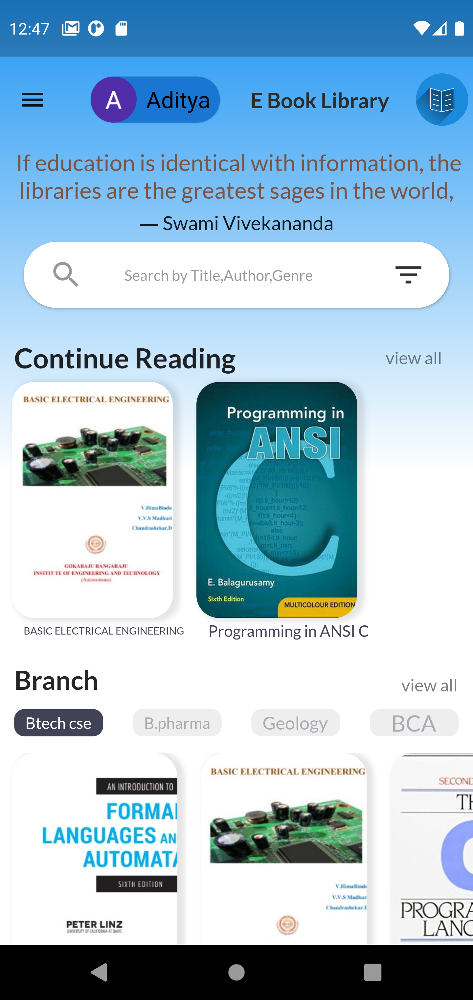
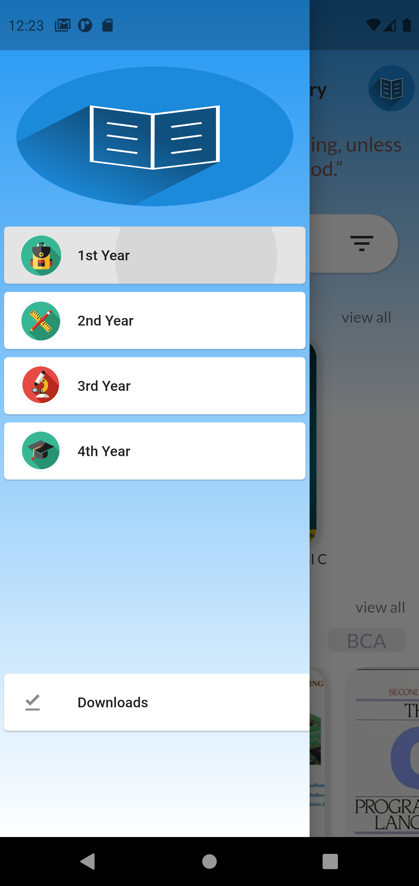
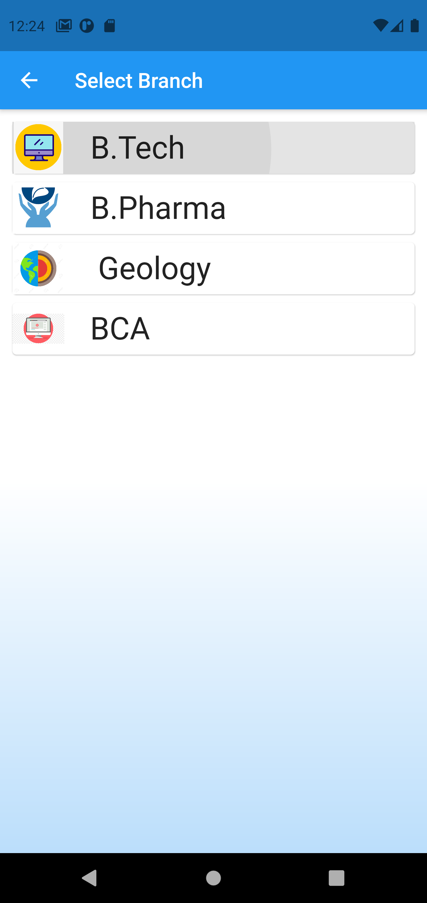
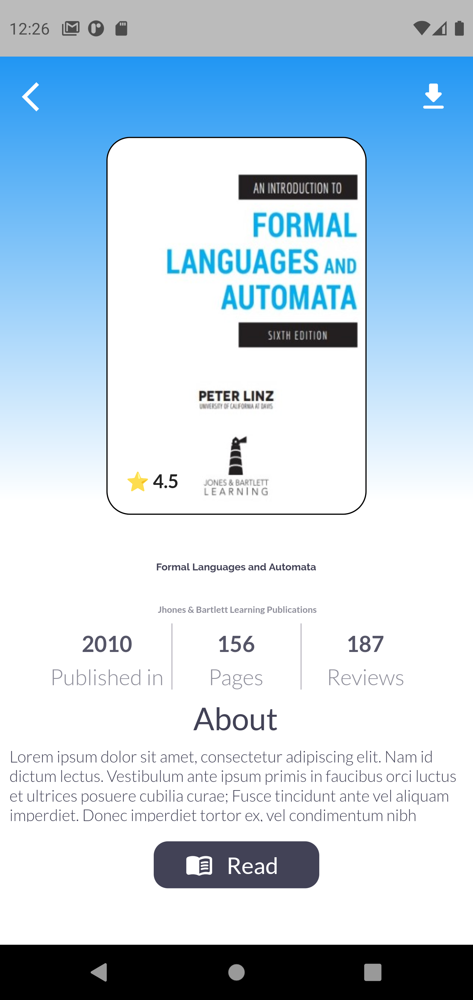
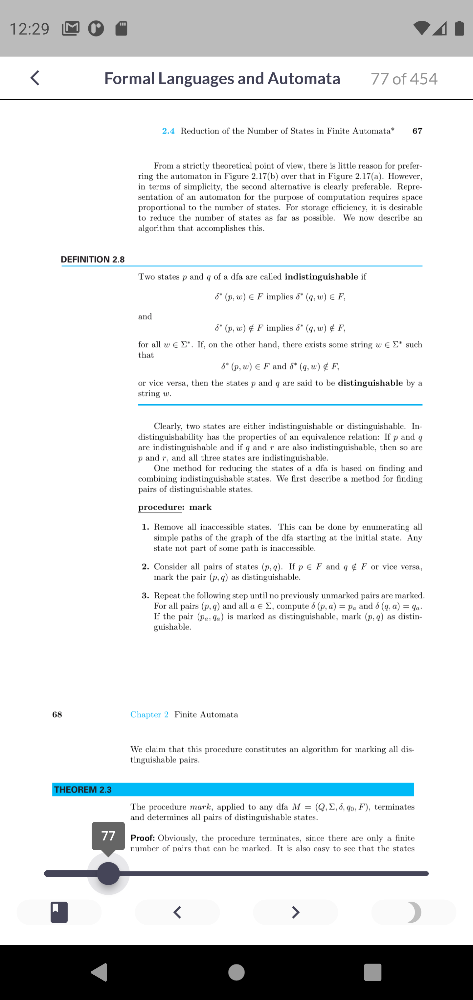

# ebook-library
A Simple Sophisticated Ebook Library App with built in Ebook Reader And Smooth and Responsive UI/UX 

## Features :-
* Category bassed filters
* Search Books Based on Author,Title,Subject etc
* Google Sign-In Enabled
* Simple and Flexible UI
### External Packages Used :-
[flutter_pdfview](https://pub.dev/packages/flutter_pdfview)
